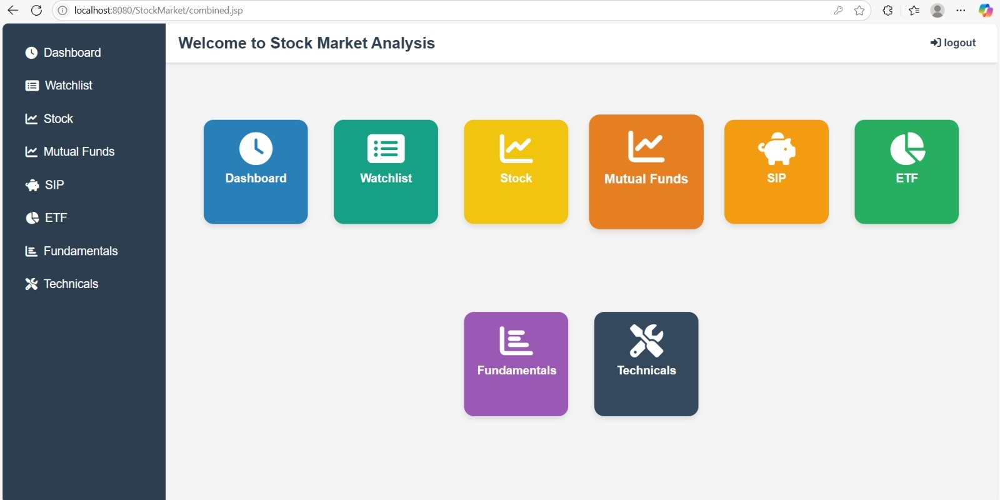
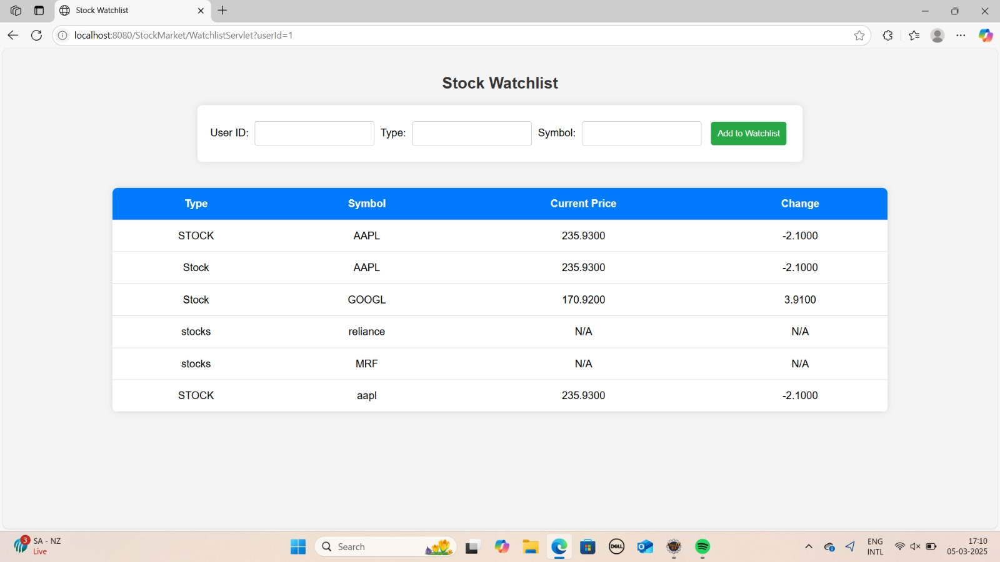

# 📈 Stock Market System

### 🎓 Final-Year BCA Project

A web-based **Stock Market System** developed using **Java Servlets, JSP, MySQL, and external market data APIs**. The application provides stock market information along with analysis and investment-related modules.

---

## 🚀 Features

* 🔐 User Registration & Login
* 📊 Stock Market Data
* 📈 Technical Analysis
* 📋 Fundamental Analysis
* ⭐ Personalized Watchlist
* 🏦 Exchange-Traded Funds (ETFs)
* 💰 Mutual Funds
* 🏷️ Initial Public Offerings (IPOs)
* 💵 Systematic Investment Plans (SIPs)
* 🏛️ Government Securities
* 🌐 External API Integration
* 🗄️ MySQL Database Integration

---

## 🖥️ Project Screenshots

Here are some screenshots showcasing the user interface and key functionality of the Stock Market System.

### 🏠 Dashboard

The dashboard provides users with access to the major stock market and investment-related modules of the application.



### 📊 Stock Market

The stock market module displays market-related information integrated through external market data APIs.




---

## 🛠️ Technologies Used

| Technology    | Usage                       |
| ------------- | --------------------------- |
| Java 8        | Backend Development         |
| Servlets      | Request Handling            |
| JSP           | Web Pages / UI              |
| MySQL         | Database                    |
| JDBC          | Database Connectivity       |
| Maven         | Project Management          |
| Apache Tomcat | Application Server          |
| JSTL          | JSP Support                 |
| Gson          | JSON Processing             |
| org.json      | JSON Processing             |
| Jsoup         | Web Data Processing         |
| Commons DBCP  | Database Connection Pooling |

### APIs / Data Sources

* Alpha Vantage API
* Polygon API
* RBI-related web data processing

> API availability and usage limits depend on the respective service providers.

---

## 📂 Project Structure

```text
StockMarket
│
├── src
│   └── main
│       ├── java
│       │   └── com.nt
│       │       ├── CreateSIPServlet.java
│       │       ├── ETFServlet.java
│       │       ├── GovernmentSecurityServlet.java
│       │       ├── IPOServlet.java
│       │       ├── LoginServlet.java
│       │       ├── LogoutServlet.java
│       │       ├── MutualFundServlet.java
│       │       ├── NavigationServlet.java
│       │       ├── SignupServlet.java
│       │       ├── StockDataFetcher.java
│       │       ├── StockServlet.java
│       │       ├── UserDAO.java
│       │       └── WatchlistServlet.java
│       │
│       └── webapp
│           ├── dashboard.jsp
│           ├── stock.jsp
│           ├── technicals.jsp
│           ├── fundamentals.jsp
│           ├── watchlist.jsp
│           ├── etf.jsp
│           ├── mf.jsp
│           ├── ipo.jsp
│           ├── sip.jsp
│           ├── g_sec.jsp
│           ├── login.jsp
│           └── signup.jsp
│
├── pom.xml
└── README.md
```

---

## ⚙️ Requirements

Before running the project, make sure you have:

* Java 8 or compatible JDK
* Apache Maven
* MySQL
* Apache Tomcat
* Eclipse / Spring Tool Suite or another Java IDE
* Required API keys

---

## ▶️ How to Run

### 1. Clone the Repository

```bash
git clone https://github.com/rupesshhh-coder/stock-market-system.git
```

### 2. Open the Project

Open the project in Eclipse or your preferred Java IDE.

### 3. Configure MySQL

Create the required MySQL database and tables used by the application.

Update the database configuration with your own:

```text
Database URL
Username
Password
```

### 4. Configure API Keys

The GitHub version does not contain real API keys.

Add your own API keys for the required external services before running the application.

### 5. Build the Project

```bash
mvn clean package
```

### 6. Deploy

Deploy the generated WAR file to Apache Tomcat.

The application can then be accessed through:

```text
http://localhost:8080/StockMarket
```

---

## 🔒 Security Note

For security reasons, real database passwords and API keys are **not included in this repository**.

Before running the application, configure your own credentials and API keys locally.

---

## 📚 What I Learned

Through this project, I gained practical experience in:

* Java web application development
* Servlet and JSP development
* MySQL database connectivity
* JDBC
* API integration
* JSON data processing
* Technical and fundamental analysis concepts
* User authentication
* Watchlist functionality
* Maven project management
* Application deployment basics
* Team coordination and project development

---

## 🎓 Academic Project

**Project:** Stock Market System
**Course:** Bachelor of Computer Applications (BCA)
**Type:** Final-Year Academic Project

This project was developed as part of my **BCA final-year project** to gain practical experience in Java web development, database integration, API integration, and building a complete web-based application.

---

## 👨‍💻 Author

**Rupesh Ghadge**

GitHub: [rupesshhh-coder](https://github.com/rupesshhh-coder)

---

⭐ If you find this project useful, feel free to explore the repository.
